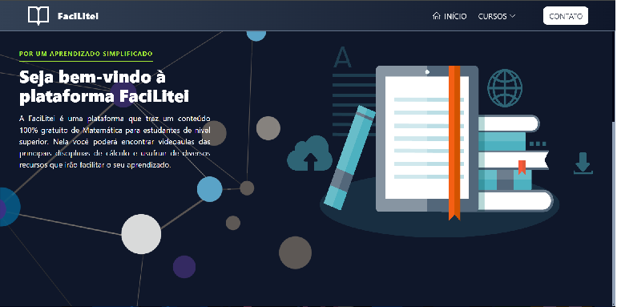
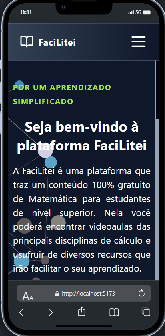

# FaciLitei

## Clonando o projeto e instalando as dependências

- Crie uma cópia desse projeto em seu dispositivo utilizando o comando `git clone` https://github.com/RickM19/FaciLitei
- Instale as dependências necessárias utilizando o comando `npm install`
- Execute utilizando o comando `npm run dev`

## Modelo

### Mobile

## 🛠 Tecnologias

- <a href="https://developer.mozilla.org/pt-BR/docs/Web/JavaScript">Javascript</a>
- <a href="https://developer.mozilla.org/pt-BR/docs/Web/HTML">HTML</a>
- <a href="https://developer.mozilla.org/pt-BR/docs/Web/CSS">CSS</a>
- <a href="https://git-scm.com/">Git</a>
- <a href="https://tailwindcss.com">TailwindCSS</a>
- <a href="https://react.dev/">React.js</a>
- <a href="https://www.npmjs.com/">NPM</a>

## 🚀 Autor
Riquelmo Medeiros, estudante de Desenvolvimento Web **front-end**, atualmente cursando ciência da computação pela Universidade Federal Rural do Semiárido.

## Informações Adicionais

- 🧠 Bom conhecimento em:
- **Javascript**
- **HTML**
- **CSS**

- 📘 Estudando agora:

- **React**
- **TailwindCSS**
- **Redux**

## Perfis para contato
Você pode me encontrar e visualizar minhas atividades através dos links abaixo:
- <a href="https://github.com/RickM19">Github</a>
- <a href="https://www.linkedin.com/in/riquelmo-medeiros-5a1304288/">Linkedin</a>
- <a href="https://www.instagram.com/riquelmo_rick/">Instagram</a>
